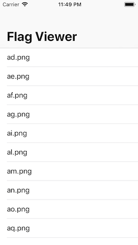
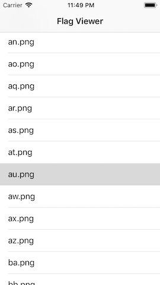
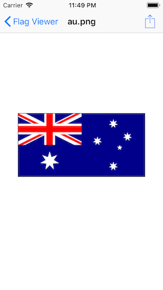
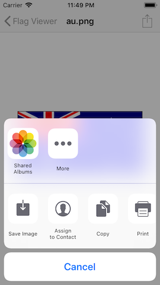
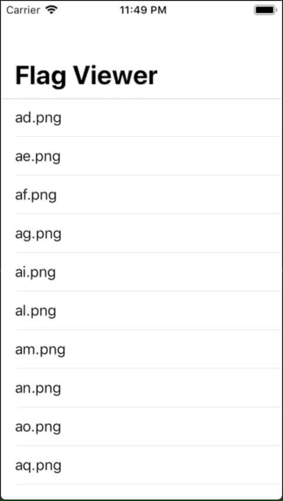

# Flag Viewer

## Description
You'll see an app that lets users scroll through a list of images that are the ISO of flags, then select one to view the flag and be able to share it.

## Demo
| Screenshot 01 | Screenshot 02 |
| ------------- | ------------- |
|  |  |

| Screenshot 03 | Screenshot 04 |
| ------------- | ------------- |
|  |  |

| Demo |
| ---- |
|  |